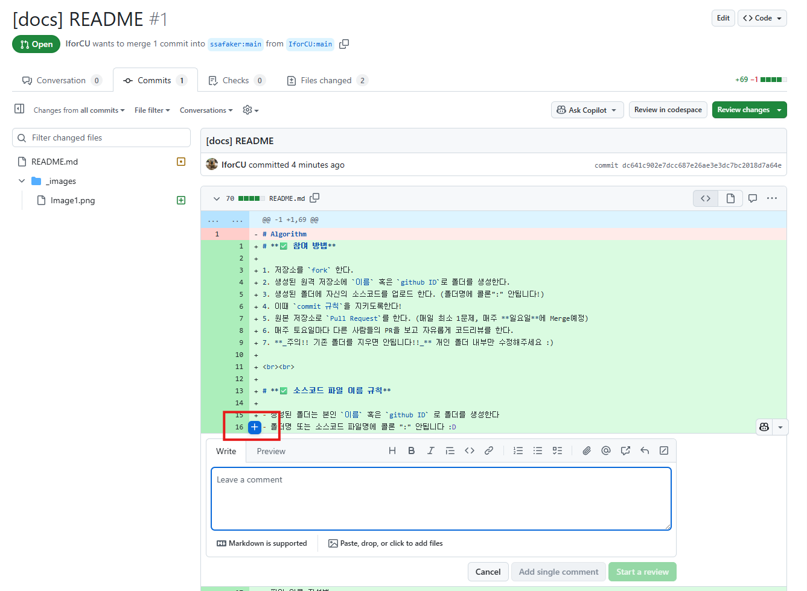

# **✅ 참여 방법**

- 저장소를 `fork` 한다.

  1. fork를 생성
  2. 본인 리포지토리 이름은 자유롭게
     
  3. 깃을 클론함
     `git clone [주소]`
     

  4. 이후 규칙에 맞게 사용

- 생성된 원격 저장소에 `이름` 혹은 `github ID`로 폴더를 생성한다.
- 생성된 폴더에 자신의 소스코드를 업로드 한다. (폴더명에 콜론":" 안됩니다!)
- 이때 `commit 규칙`을 지키도록한다!
- 원본 저장소로 `Pull Request`를 한다. (매일 최소 1문제, 매주 **일요일**에 Merge예정)

  1. PR 생성
     

  2. 본인 저장소와 리퀘스트를 요청할 저장소 확인후 PR 생성
     

- 매주 토요일마다 다른 사람들의 PR을 보고 자유롭게 코드리뷰를 한다.

  1. 컨벤션을 이용한 댓글 달기
     

  2. 코드에 직접 댓글달기
     
     

- **_주의!! 기존 폴더를 지우면 안됩니다!!_** 개인 폴더 내부만 수정해주세요 :)
  <br><br>

## ✅ 소스코드 파일 이름 규칙

### 폴더명 규칙

- 생성된 폴더는 본인 `이름` 혹은 `github ID` 로 폴더를 생성한다

  

- 폴더명 또는 소스코드 파일명에 콜론 ":" 안됩니다 :D

### 파일명 규칙

- 파일 이름 작성법:

```java
// 자바 기준
Main_[플랫폼]_[문제번호]

```

- 예시:
  - `Main_BOJ_1000.java`
  - `Main_PGS_12345.java`
  - `Main_LTC_242.java`

### 코드 주석

- 코드에 주석으로 해당 문제에 대한 간단한 설명 추가
- 이후 주석으로 어떻게 풀었는지에 대한 설명 추가

```jsx
/*
 *  문제명: [문제 이름]
 *  링크 : [링크]
 *  난이도 : [난이도]
 *  설명: 문제를 간략히 이해한 내용을 적음.
 *  풀이: 사용한 알고리즘/구현방법 요약해서 설명.
 */
```

## ✅ Commit 규칙

### 기본 형식

- **commit 메세지**: `[문제 출처(플랫폼)] 문제이름 / 난이도 / 걸린시간`
- **description**: 문제 주소 (option)

### 터미널에서 작성법

```bash
git commit -m "[BOJ] Hello World / 브론즈5 / 1분" -m "https://www.acmicpc.net/problem/2557"

```

### 플랫폼 작성법 통일

- `[BOJ]` - 백준
- `[PGS]` - 프로그래머스
- `[LTC]` - 리트코드
- `[CFS]` - 코드포스
- `[SEA]` - 삼성SW Expert Academy
- `[ETC]` - 그외

### Commit 메시지 예시

```
[BOJ] A+B / 브론즈5 / 3분
[PGS] 두 개 뽑아서 더하기 / 레벨1 / 15분
[LTC] Two Sum / Easy / 20분
[CFS] Watermelon / 800점 / 10분

```

## ✅ PR (Pull Request) 규칙

### PR 제목 형식

`이름 / 날짜 / 몇 문제`

**예시**: `jaewon han / 2025-08-01 / 4문제`

### PR 설명 작성법

PR 생성 시에는 간단한 문제 현황만 작성하고, **코드리뷰가 완료된 후 회고를 추가**합니다.

### 초기 PR 설명 템플릿

```markdown
## 📊 이번 주 문제 풀이 현황

- **총 해결 문제 수**: X문제
- **플랫폼별 분포**: BOJ X문제, PGS X문제, LTC X문제
- **난이도별 분포**: 브론즈 X문제, 실버 X문제, 골드 X문제

## 🧩 해결한 문제 목록

- [BOJ] 문제명 (난이도) - 알고리즘 분류
- [PGS] 문제명 (난이도) - 알고리즘 분류
- [LTC] 문제명 (난이도) - 알고리즘 분류

---

**📝 회고는 코드리뷰 완료 후 작성 예정입니다**
```

## ✅ 코드리뷰 규칙 (Option)

### 📅 코드리뷰 진행 일정

- **매주 월요일**: PR 템플릿 생성
- **매주 금요일**: PR 템플릿 정리
- **매주 토요일**: 코드리뷰 진행일
- **일요일 Merge 전**: 모든 리뷰 완료 및 회고 작성 완료

### 코드리뷰 진행 방식

- PR에서 코드리뷰를 한다
- 전체 코드 흐름을 파악한 뒤, 이 분이 어떻게 풀었을까 이해를 한 후 의견제시

### 코드리뷰 포인트

- **잘했다고 생각하는 부분**
  - 깔끔한 코드 구조
  - 효율적인 알고리즘 선택
  - 좋은 변수명 사용 등
- **이렇게 하면 더 좋을 것 같다고 생각하는 부분**
  - 시간/공간 복잡도 개선 방안
  - 코드 가독성 향상 방법
  - 더 간결한 구현 방법 등
- **왜 이렇게 풀었는지 궁금한 부분**
  - 특정 자료구조나 알고리즘을 선택한 이유
  - 독특한 접근 방식에 대한 질문
- **또 다른 풀이 방식 제시**
  - 대안적인 알고리즘 소개
  - 다른 언어로의 구현 방법
  - 최적화 아이디어 공유

### 코드리뷰 작성 위치

- 코드의 일부분에 직접 코멘트
- 전체 코드 하단에 종합적인 리뷰
- PR 전체에 대한 총평

### 코드리뷰 예시

```
👍 **잘한 점**
- 변수명이 직관적이고 이해하기 쉽습니다
- 엣지 케이스 처리가 잘 되어 있네요

🤔 **궁금한 점**
- 21번째 줄에서 ArrayList 대신 LinkedList를 사용한 특별한 이유가 있나요?

💡 **제안사항**
- Stream API를 사용하면 더 간결하게 작성할 수 있을 것 같아요
- 시간 복잡도를 O(n²)에서 O(n log n)으로 개선할 수 있는 방법이 있습니다

🔄 **다른 접근법**
- 이분 탐색을 활용한 풀이도 가능할 것 같은데, 어떻게 생각하시나요?

```

## ✅ 회고 작성 방법 (코드리뷰 완료 후)

### 회고 작성 시점

**코드리뷰가 모두 완료된 후**, PR 설명을 수정하여 회고를 추가합니다.

### 회고 템플릿

코드리뷰를 통해 받은 피드백을 반영하여 다음과 같은 형식으로 회고를 작성해주세요:

```markdown
## 💡 이번 주 학습 내용

### 새로 배운 알고리즘/자료구조

- 알고리즘명: 간단한 설명 및 느낀점

### 어려웠던 문제

- **문제명 (난이도)**: 어려웠던 이유와 해결 과정
- **문제명 (난이도)**: 어려웠던 이유와 해결 과정

### 인상 깊었던 문제

- **문제명 (난이도)**: 왜 인상 깊었는지, 배운 점

## 📝 코드리뷰 반영 사항

### 받은 피드백 정리

- **리뷰어명**: 받은 주요 피드백 내용
- **리뷰어명**: 받은 주요 피드백 내용

### 피드백을 통해 배운 점

- 구체적으로 어떤 점을 배웠는지
- 앞으로 적용하고 싶은 내용

### 추가로 시도해본 것들

- 리뷰를 바탕으로 코드를 개선했다면 어떻게 개선했는지
- 제안받은 다른 풀이법을 시도해봤다면 그 결과

## 🔄 개선 사항

### 이번 주 아쉬웠던 점

- 예: 시간 복잡도를 충분히 고려하지 못했다
- 예: 엣지 케이스 처리가 부족했다
- **코드리뷰를 통해 발견한 부족한 점들**

### 다음 주 목표

- 예: DP 문제 집중 연습하기
- 예: 코드 가독성 향상하기
- **리뷰 피드백을 바탕으로 한 구체적인 개선 계획**

## 📈 전체적인 소감

이번 주 전반적인 학습 소감과 **코드리뷰 경험**을 포함한 다음 주 계획을 자유롭게 작성
```

### 회고 작성 예시

```markdown
## 📊 이번 주 문제 풀이 현황

- **총 해결 문제 수**: 7문제
- **플랫폼별 분포**: BOJ 5문제, PGS 2문제
- **난이도별 분포**: 브론즈 2문제, 실버 3문제, 골드 2문제

## 🧩 해결한 문제 목록

- [BOJ] Hello World (브론즈5) - 구현
- [BOJ] A+B (브론즈5) - 구현
- [BOJ] DFS와 BFS (실버2) - 그래프 탐색
- [BOJ] 바이러스 (실버3) - BFS
- [BOJ] 1로 만들기 (실버3) - DP
- [PGS] 체육복 (레벨1) - 그리디
- [PGS] 정수 삼각형 (레벨3) - DP

## 💡 이번 주 학습 내용

### 새로 배운 알고리즘/자료구조

- BFS: 큐를 이용한 너비우선탐색을 처음 구현해봤는데 생각보다 직관적이었다

### 어려웠던 문제

- **정수 삼각형 (레벨3)**: DP 점화식을 세우는 것이 어려웠지만, 하향식과 상향식 접근을 모두 시도해보며 이해할 수 있었다

### 인상 깊었던 문제

- **바이러스 (실버3)**: 간단한 BFS 문제였지만 그래프 탐색의 기본기를 다질 수 있어서 좋았다

## 📝 코드리뷰 반영 사항

### 받은 피드백 정리

- **alice123**: DFS 구현에서 재귀 대신 스택을 사용하는 방법을 제안해주셨음
- **bob_dev**: 정수 삼각형 문제에서 메모이제이션을 활용한 더 효율적인 방법을 알려주셨음
- **charlie\_**: 변수명을 더 직관적으로 짓는 방법에 대해 조언해주셨음

### 피드백을 통해 배운 점

- 재귀 DFS가 스택 오버플로우 위험이 있다는 것을 알게 되었음
- Top-down DP에서 메모이제이션의 중요성을 깨달았음
- 코드 가독성이 협업에서 얼마나 중요한지 느꼈음

### 추가로 시도해본 것들

- alice123님 제안대로 스택을 이용한 DFS로 코드를 다시 작성해봤는데 확실히 안전했음
- 메모이제이션을 적용한 버전으로 정수 삼각형을 다시 풀어봤더니 훨씬 빨라졌음

## 🔄 개선 사항

### 이번 주 아쉬웠던 점

- 문제를 너무 빨리 읽고 지나가서 조건을 놓치는 경우가 있었다
- **코드리뷰를 통해 발견한 점: 변수명이 일관성이 없고 너무 축약되어 있었음**

### 다음 주 목표

- 문제 조건을 꼼꼼히 읽고 예외 케이스까지 고려하기
- 골드 문제 비율 늘리기
- **변수명과 함수명을 더 명확하게 작성하기**
- **다른 사람의 코드도 적극적으로 리뷰해보기**

## 📈 전체적인 소감

이번 주는 BFS/DFS를 집중적으로 공부했는데, 그래프 탐색에 대한 이해도가 많이 높아진 것 같다.
특히 **코드리뷰를 통해 내가 놓치고 있던 부분들을 많이 발견할 수 있어서 정말 유익했다.**
다른 분들의 다양한 접근법을 보면서 같은 문제도 여러 방식으로 해결할 수 있다는 것을 배웠다.
다음 주에는 받은 피드백을 적극 반영해서 더 깔끔하고 효율적인 코드를 작성해보고 싶다.
```

---

**📌 참고사항**

- 매일 최소 1문제씩 꾸준히 풀기
- **매주 월요일** : PR 생성
- **매주 금요일** : PR 템플릿 정리
- **매주 토요일** : 코드리뷰 진행
- **매주 일요일** : 회고 작성 완료 후 Merge 예정
- 개인 폴더 외의 다른 폴더는 절대 건드리지 말기
- 코드리뷰는 서로의 성장을 위한 것이니 적극적으로 참여하기
- **회고는 반드시 코드리뷰 완료 후 작성하여 학습 효과 극대화하기**
